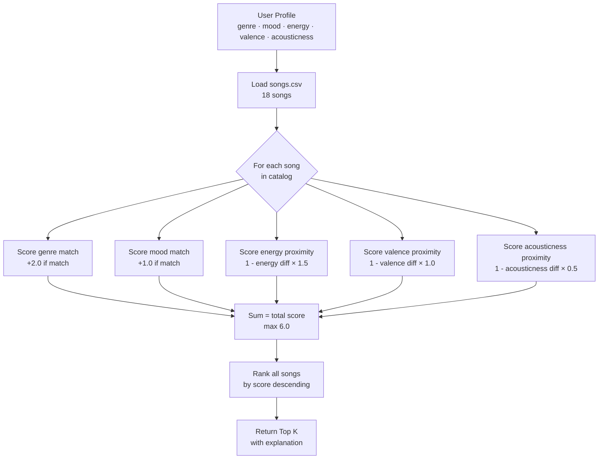

# 🎵 Music Recommender Simulation

## Project Summary

In this project you will build and explain a small music recommender system.

Your goal is to:

- Represent songs and a user "taste profile" as data
- Design a scoring rule that turns that data into recommendations
- Evaluate what your system gets right and wrong
- Reflect on how this mirrors real world AI recommenders

This simulation builds a content-based music recommender that matches songs to a user's taste profile using audio features and categorical labels. Unlike real-world systems that rely on millions of users' listening histories (collaborative filtering), this version focuses purely on song attributes — energy, mood, genre, valence, and acousticness — to compute a compatibility score for each song. The top-K scoring songs are returned as recommendations with a plain-language explanation of why each was chosen.

---

## How The System Works

Real-world recommenders like Spotify's Discover Weekly combine two strategies: **collaborative filtering** (finding users with similar listening histories and borrowing their taste) and **content-based filtering** (analyzing the audio attributes of songs themselves). At scale, Spotify processes billions of listening events and hundreds of audio features extracted from raw audio using machine learning models. This simulation focuses on content-based filtering with a small, hand-crafted dataset to make the logic transparent and inspectable.

**This version prioritizes:** matching a user's declared mood and genre context first, then fine-tuning by how close a song's energy and emotional tone (valence) are to the user's preference — mirroring the way a person might pick a playlist by vibe before worrying about specific sound texture.

---

### Dataset

`data/songs.csv` contains **18 songs** across a diverse range of genres and moods:

| Genres | Moods |
|---|---|
| pop, indie pop, lofi, rock, jazz | happy, chill, intense, relaxed, moody |
| synthwave, ambient, hip-hop, r&b | focused, nostalgic, romantic, peaceful |
| classical, country, edm, metal, folk, funk | energetic, angry |

---

### Song Object Features

Each `Song` uses the following attributes:

| Feature | Type | Role in Scoring |
|---|---|---|
| `genre` | categorical | Hard boundary — highest weight match bonus |
| `mood` | categorical | Use-case label — second highest weight |
| `energy` | float 0–1 | Proximity scored against user's target energy |
| `valence` | float 0–1 | Emotional positivity — proximity scored |
| `acousticness` | float 0–1 | Organic vs. electronic texture — proximity scored |

*(`tempo_bpm` and `danceability` are in the data and available for future expansion.)*

---

### UserProfile

The user profile is a dictionary with these keys:

```python
user_prefs = {
    "genre":       "pop",    # target genre (string)
    "mood":        "happy",  # target mood context (string)
    "energy":      0.8,      # target intensity (float 0–1)
    "valence":     0.8,      # target emotional positivity (float 0–1)
    "acousticness": 0.2,     # target texture (float 0–1)
}
```

**Why this profile works for differentiation:** A user with `energy: 0.8` and `mood: happy` will clearly separate *Gym Hero* (pop/intense, energy 0.93) from *Library Rain* (lofi/chill, energy 0.35). Genre alone would miss *Rooftop Lights* (indie pop/happy) which is a strong match — so the numeric features catch cross-genre vibe alignment.

---

### Algorithm Recipe — Scoring Rule (one song)

```
score = (genre_match  × 2.0)
      + (mood_match   × 1.0)
      + (1 - |song.energy      - user.energy|)      × 1.5
      + (1 - |song.valence     - user.valence|)     × 1.0
      + (1 - |song.acousticness - user.acousticness|) × 0.5
```

- **Categorical match** = full weight if equal, 0 if not
- **Proximity score** = `1 - |song_value - user_value|` (always 0–1 since features are on 0–1 scale)
- **Maximum possible score** = 2.0 + 1.0 + 1.5 + 1.0 + 0.5 = **6.0**

**Weight rationale:**
- `genre` (2.0) — strongest style boundary; a metal fan won't enjoy ambient regardless of energy
- `energy` (1.5) — most continuous and reliable vibe signal; paired with mood it defines intensity
- `mood` (1.0) — important but sometimes genre already implies mood (rock → intense)
- `valence` (1.0) — emotional positivity catches the happy/dark split within a genre
- `acousticness` (0.5) — texture preference is flexible; lowest weight

---

### Ranking Rule (full catalog)

1. Run the scoring rule on every song in the 18-song catalog
2. Sort all `(song, score)` pairs in descending order
3. Return the top `k` results, each with a plain-language explanation

---

### Data Flow — Mermaid Diagram



---

### Expected Bias

> "This system may over-prioritize genre, causing songs with a perfect mood and energy match but a different genre label to rank lower than they deserve. A chill hip-hop track might lose to a mediocre lofi track just because the genre string matches. Additionally, the system treats all users as having the same 'taste shape' — it cannot learn that one user is flexible on genre but strict on energy."

---

## Getting Started

### Setup

1. Create a virtual environment (optional but recommended):

   ```bash
   python -m venv .venv
   source .venv/bin/activate      # Mac or Linux
   .venv\Scripts\activate         # Windows

2. Install dependencies

```bash
pip install -r requirements.txt
```

3. Run the app:

```bash
python -m src.main
```

### Running Tests

Run the starter tests with:

```bash
pytest
```

You can add more tests in `tests/test_recommender.py`.

---

## Experiments You Tried

Use this section to document the experiments you ran. For example:

- What happened when you changed the weight on genre from 2.0 to 0.5
- What happened when you added tempo or valence to the score
- How did your system behave for different types of users

---

## Limitations and Risks

Summarize some limitations of your recommender.

Examples:

- It only works on a tiny catalog
- It does not understand lyrics or language
- It might over favor one genre or mood

You will go deeper on this in your model card.

---

## Reflection

Read and complete `model_card.md`:

[**Model Card**](model_card.md)

Write 1 to 2 paragraphs here about what you learned:

- about how recommenders turn data into predictions
- about where bias or unfairness could show up in systems like this


---

## 7. `model_card_template.md`

Combines reflection and model card framing from the Module 3 guidance. :contentReference[oaicite:2]{index=2}  

```markdown
# 🎧 Model Card - Music Recommender Simulation

## 1. Model Name

Give your recommender a name, for example:

> VibeFinder 1.0

---

## 2. Intended Use

- What is this system trying to do
- Who is it for

Example:

> This model suggests 3 to 5 songs from a small catalog based on a user's preferred genre, mood, and energy level. It is for classroom exploration only, not for real users.

---

## 3. How It Works (Short Explanation)

Describe your scoring logic in plain language.

- What features of each song does it consider
- What information about the user does it use
- How does it turn those into a number

Try to avoid code in this section, treat it like an explanation to a non programmer.

---

## 4. Data

Describe your dataset.

- How many songs are in `data/songs.csv`
- Did you add or remove any songs
- What kinds of genres or moods are represented
- Whose taste does this data mostly reflect

---

## 5. Strengths

Where does your recommender work well

You can think about:
- Situations where the top results "felt right"
- Particular user profiles it served well
- Simplicity or transparency benefits

---

## 6. Limitations and Bias

Where does your recommender struggle

Some prompts:
- Does it ignore some genres or moods
- Does it treat all users as if they have the same taste shape
- Is it biased toward high energy or one genre by default
- How could this be unfair if used in a real product

---

## 7. Evaluation

How did you check your system

Examples:
- You tried multiple user profiles and wrote down whether the results matched your expectations
- You compared your simulation to what a real app like Spotify or YouTube tends to recommend
- You wrote tests for your scoring logic

You do not need a numeric metric, but if you used one, explain what it measures.

---

## 8. Future Work

If you had more time, how would you improve this recommender

Examples:

- Add support for multiple users and "group vibe" recommendations
- Balance diversity of songs instead of always picking the closest match
- Use more features, like tempo ranges or lyric themes

---

## 9. Personal Reflection

A few sentences about what you learned:

- What surprised you about how your system behaved
- How did building this change how you think about real music recommenders
- Where do you think human judgment still matters, even if the model seems "smart"

