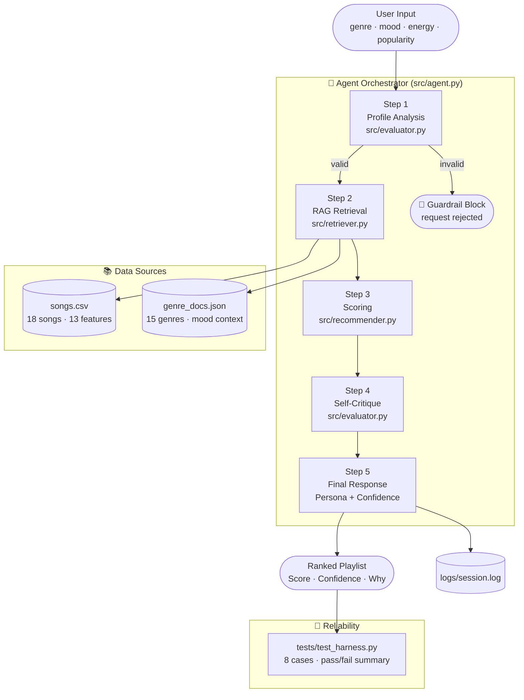

# SoundMatch 2.0 — System Architecture Diagram

> Paste the Mermaid code below into https://mermaid.live to export as PNG.

```mermaid
flowchart TD
    A([User Input\ngenre · mood · energy · popularity]) --> B

    subgraph AGENT ["🤖 Agent Orchestrator  (src/agent.py)"]
        B[Step 1\nProfile Analysis\nsrc/evaluator.py] -->|valid| C
        B -->|invalid| G([🚫 Guardrail Block\nrequest rejected])
        C[Step 2\nRAG Retrieval\nsrc/retriever.py] --> D
        D[Step 3\nScoring\nsrc/recommender.py] --> E
        E[Step 4\nSelf-Critique\nsrc/evaluator.py] --> F
        F[Step 5\nFinal Response\nPersona + Confidence]
    end

    subgraph SOURCES ["📚 Data Sources"]
        S1[(songs.csv\n18 songs · 13 features)]
        S2[(genre_docs.json\n15 genres · mood context)]
    end

    C --> S1
    C --> S2

    F --> OUT([Ranked Playlist\nScore · Confidence · Why])
    F --> LOG[(logs/session.log)]

    subgraph TESTING ["🧪 Reliability"]
        T[tests/test_harness.py\n8 cases · pass/fail summary]
    end

    OUT --> T
```
